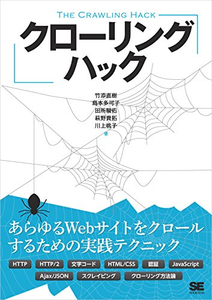
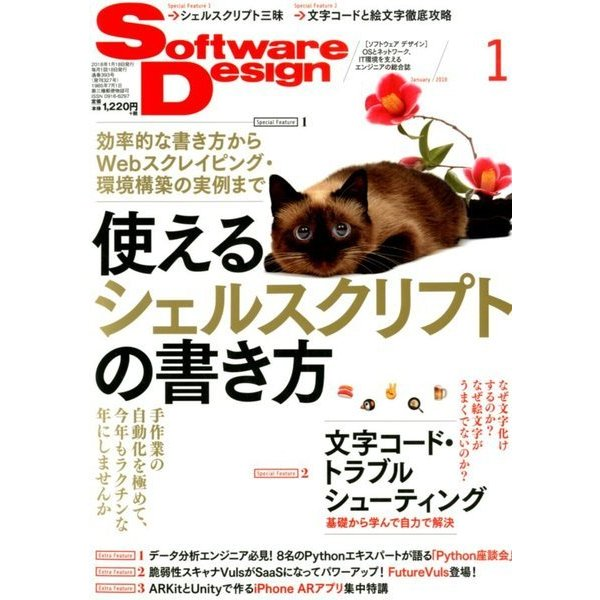

# とりあえずScalaをはじめるときに
# 知っておきたい10のこと


2017.12.21  
[@todokr](https://twitter.com/todokr)


+++


## 誰だ


+++


## 田所 駿佑


- 株式会社ビズリーチ Scalaエンジニア
- 求人検索エンジン Webクローラーや広告システムの開発
- 一部ではエモジニアと呼ばれています
- 文字コードとかEmacsが好きなネオ老害

+++



+++



+++

## 今日のお題

- Scalaを書き始める
- Scalaを布教し始める
- Scalaをチームで使い始める

ときに知っておくとよさそうなことを  
独断と偏見で紹介します

+++

## とりあえず書き始めるときに知っておきたい

- sbtは常駐させる |
- REPLと友だちになろう |
- ???でざっくりスケッチ |
- 謎の記号はscapsで |

+++

### sbtは常駐させる
- 「Scalaはコンパイルが遅い！」→ 毎回sbt立ち上げてない？
- 常駐させたままコンパイルを繰り返すとJVMのwarmupで速度向上。落としたら負け。
- `$ sbt xxx` ではなく、`$ sbt` してから `xxx`

+++

### REPLと友だちになろう

- Read Eval Print Loop
- `$ scala`
  - Scalaの標準ライブラリのみのインタプリタを開始
- `$ sbt console`
  - コンパイル済のソースと依存ライブラリにクラスパスを通して、Scalaインタプリタを開始
- scastie（https://scastie.scala-lang.org/）
  - ブラウザから手軽に試せる

+++

### ???でざっくりスケッチ

- `???` というメソッド
- まだ実装していない部分をマークしておくためにある
- コンパイルできるが呼ぶと例外
- 引数や返り値の型を先に考えて、後から中身を実装するときに役立つ

```scala
def someNiceMethod(x: Int): Option[String] = ???
def otherCoolMethod(x: Option[String]): String = ???

val result = otherCoolMethod(someNiceMethod(42))
```

+++
 
### 謎の記号はscapsで

- `???`を筆頭にググラビリティの低いメソッドなどがある
- ググると悲しい結果になる
- そういうときは[scaps](http://scala-search.org/)で検索すると正体が分かる

+++

## 布教し始めるときに知っておきたい

- とりあえず読ませる本・記事 |
- 学習のための良い資料 |
- 最後の手段 |

+++

### とりあえず読ませる記事

- 興味を持ちそうな人に「これ読んでみなよ」と渡せるものがあると楽
  - [Scala先駆者インタビュー](https://www.atware.co.jp/search?q=Scala%E5%85%88%E9%A7%86%E8%80%85%E3%82%A4%E3%83%B3%E3%82%BF%E3%83%93%E3%83%A5%E3%83%BC&f_collectionId=546d8fc4e4b06f0363347eaa)
  - [Scala使用歴5年のプログラマが、この言語とその環境に関する神話を解き明かす](http://postd.cc/5-years-of-scala-and-counting-debunking-some-myths-about-the-language-and-its-environment/)
  - [実践ScalaでDDD](https://speakerdeck.com/crossroad0201/scala-on-ddd)
 
+++

### 学習のための良い資料

- [やってみよう Scala！ By Fringe81](https://qiita.com/f81@github/items/369d3ad97112b20d9bc5)
- [Scala Exercises](https://www.scala-exercises.org/)
  - Scalaチュートリアルや標準ライブラリのコースがおすすめ
 - gakuzzzzさんの資料
   - [Scala の省略ルール早覚え](https://gist.github.com/gakuzzzz/10104162)
   - [Readable Scala](http://gakuzzzz.github.io/slides/readable_scala)
   - [Refactoring in Scala](http://gakuzzzz.github.io/slides/refactoring_in_scala)

+++

### 最後の手段

- 「Scala 年収」でググってもらう;) |

+++

## チームで使い始めるときに知っておきたい

- 教育もセットで考えよう |
- スタイルに合意しよう |
- 既に使っているところに聞いてみよう |

+++

### 教育もセットで考えよう
- 仕事で使おうとするとやっぱり独学は大変
- 毎日プチ勉強会、ペアプロ、レビュー、困ったら直ぐ聞けるSlackチャンネルetc...
 
+++

### スタイルに合意しよう

- Scalaは表現力が豊か
- Javaのような書き方もできるし、関数型言語的な書き方も可能
- その分、人によってスタイルが揺れやすい
- どの程度関数型に寄せるか？などは特に合意しておくとよさそう

+++

### 既に使っているところに聞いてみよう

- やっぱり導入してみないと分からない問題もある
- 遠慮せず他社の人に聞いてみよう。もちろん弊社もOKです！
- 「始めたての人がどういうところに戸惑うか」などは習熟者にとって貴重な情報

+++

Scalaを書こう  
Scalaを布教しよう  
Scalaをチームで使おう

+++

### ありがとうございました
